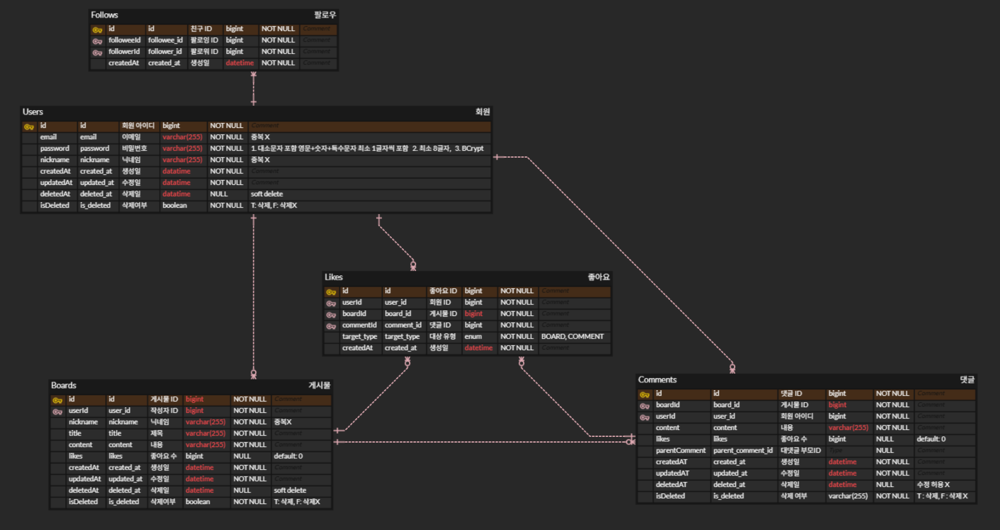

# 11조 - 스타보이즈

## 서비스 소개

### 서비스 개요
팔로우한 유저의 게시글을

최신순으로 조회가능한

SNS  플렛폼 프로젝트
## 프로젝트 주요 기능

  
회원가입

  - 이메일 중복 확인을 통해 유효한 이메일 주소가 있으면 회원 가입이 가능
  - 탈퇴 했던 이메일은 재사용 불가능

  
로그인

  - 회원가입 당시 사용했던 이메일과 비밀번호로 로그인 가능
  - JWT 토큰을 기반으로 관리

  
게시글 작성

  - 게시글 작성·수정·삭제
  - 조회는 단건, 전체, 특정 사용자, 팔로우한 사용자, 제목/내용 검색 및 페이징을 지원

  
댓글 작성

  - 게시물에 댓글 작성·수정·삭제
  - 대댓글 작성 가능 (대댓글에 대댓글 작성 불가)

  
팔로우

  - 팔로우 관계 형성
  - 팔로우, 팔로워 목록 조회

  
좋아요

  - 게시물 좋아요 & 삭제
  - 댓글 좋아요 & 삭제

## ERD

## API 명세서

### 인증
| 기능 | METHOD | ENDPOINT (URI)   |
|-----|--------|------------------|
| 회원가입 | POST   | /auth/sign-up    |
| 로그인 | POST   | /auth/sign-in    |
| 로그아웃 | POST   | /auth/logout     |
| 탈퇴 | DELETE | /auth/withdrawal |             

### 사용자
| 기능              | METHOD | ENDPOINT (URI)           |
|-----------------|--------|---------------|
| 내 정보 조회 | GET | /users/me |
| 내 정보 수정 | PATCH | /users/me |
| 비밀번호 수정 | PATCH | /users/me/password |
| 내가 작성한 게시글 조회 | GET | /users/me/boards |
| 내가 작성한 댓글 조회 | GET | /users/me/comments |
| 나의 팔로워 목록 조회 | GET | /users/me/followers |
| 나의 팔로우 목록 조회 | GET | /users/me/following |
| 특정 타입의 관심 목록 | GET | /users/me/likes?target={string} |
| 특정 유저의 정보 조회    | GET | /users/{userId} |
| 특정 유저의 게시글 조회   | GET | /users/{userId}/boards |
| 특정 유저의 댓글 조회    | GET | /users/{userId}/comments |
| 특정 유저의 팔로워 목록 조회 | GET | /users/{userId}/followers |
| 특정 유저의 팔로우 목록 조회 | GET | /users/{userId}/following |
| 닉네임 기반 유저 목록 조회 | GET | /users/search?nickname={string} |
### 게시글
| 기능 | METHOD | ENDPOINT (URI)           |
|-----|--------|---------------|
| 게시물 작성 | POST | /boards |
| 게시물 전체 목록 조회 | GET | /boards |
| 게시물 단일 조회 | GET | /boards/{boardId} |
| 게시물 수정 | PUT | /boards/{boardId} |
| 게시물 삭제 | DELETE | /boards/{boradId} |
| 특정 유저의 게시글 조회 | GET | /boards/{userId} |
| 유저의 전체 팔로워의 게시글 조회 | GET | /boards/followees |
| 특정 게시물 목록 조회 | GET | /boards/search?title={string}&content={string} |

### 댓글
| 기능 | METHOD | ENDPOINT (URI)           |
|-----|--------|---------------|
| 댓글 작성 | POST | /boards/{boradId}/comments |
| 대댓글 작성 | POST | /boards/{boradId}/comments/{commentId} |
| 댓글 목록 조회 | GET | /boards/{boradId}/comments |
| 댓글 단일 조회 | GET | /boards/{boardId}/comments/{commentId} |
| 댓글 수정 | PUT | /boards/{boardId}/comments/{commentId} |
| 댓글 삭제 | DELETE | /boards/{boardId}/comments/{commentId} |

### 좋아요
| 기능 | METHOD | ENDPOINT (URI)           |
|-----|--------|---------------|
| 게시글 좋아요 등록 | POST | /boards/{boardId}/likes |
| 게시글 좋아요 삭제 | DELETE | /boards/{boardId}/likes |
| 댓글 좋아요 등록 | POST | /boards/{boardId}/comments/{commentId}/likes |
| 댓글 좋아요 삭제 | DELETE | /boards/{boardId}/comments/{commentId}/likes |

### 친구 (팔로우)
| 기능          | METHOD | ENDPOINT (URI)           |
|-------------|--------|---------------|
| 특정 팔로우 추가   | POST | /users/me/following/{userId} |
| 내 팔로우 목록 조회 | GET | /users/me/following |
| 내 팔로워 목록 조회 | GET | /users/me/followers |
| 특정 팔로우 삭제   | DELETE | /users/me/following/{userId} |
| 특정 팔로워 삭제 | DELETE | /users/me/followers/{userId} |

## 기술 스택
**Language**

**IDE**

**Backend**

 

**Data Base**

**Test**

**Collaboration Tool**

  

## 트러블 슈팅
[팔로우 동시성 문제](https://www.notion.so/teamsparta/2552dc3ef514805a8343e45aff926e18)

[컨트롤러 Post 매핑 문제](https://www.notion.so/teamsparta/Post-2592dc3ef51480d58d96ca8f673c1c65)

[rebase error](https://www.notion.so/teamsparta/rebase-error-2592dc3ef51480f583edcb73ce77cdfe)

[Service Interface 관리](https://www.notion.so/teamsparta/Service-Interface-2592dc3ef514801981c4ed91fb3e0128)

[JWT 트러블 슈팅](https://www.notion.so/teamsparta/JWT-25a2dc3ef514801a84ade2f6880b8722)
